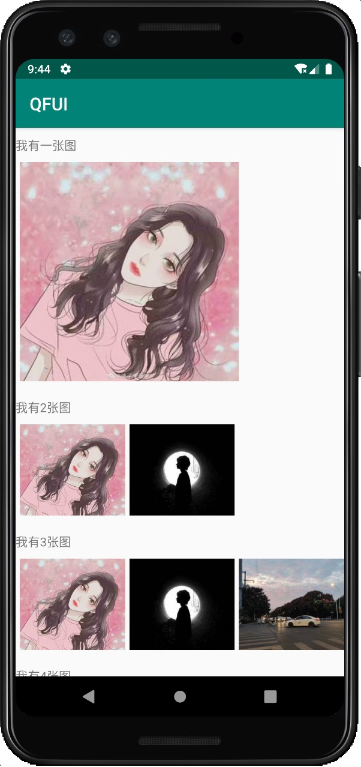
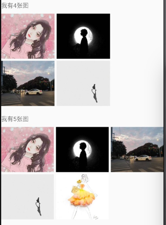
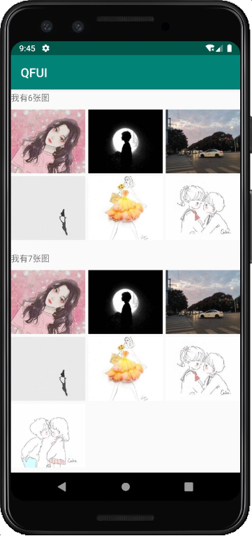

- [简介](#简介)
- [引入方式](#引入方式)
- [使用](#使用)
- [方法介绍](#方法介绍)
- [效果图](#效果图)

### 简介
   QFNineImage是类似朋友圈的九宫格图片，当只有一张图片的时候显示大图；当只有4张图时，以2*2的方式显示；其他都是按照3列方式显示

### 引入方式

### 使用 
   * xml中
     ```
      <com.qianfanyun.qfui.nineimage.QFNineImage
            android:id="@+id/iv"
            android:layout_width="wrap_content"
            android:layout_height="wrap_content"/>
     ```
     
   * java中
     ```
        List<NineImageEntity> oneList=new ArrayList<>();
        DataEntity one=new DataEntity(1080,1080,"https://ojpoc641y.qnssl.com/20191018_2524_1571386472139.jpg?imageslim|imageView2/1/w/288/h/288");
        oneList.add(one);        
        QFNineImage img1=findViewById(R.id.iv1);       
        img1.setData(oneList, new QFNineImage.NineClicklistener() {
            @Override
            public void imageClick(List<NineImageEntity> infos, int position) {

            }
        });
        注：DataEntity是需要实现NineImageEntity接口的数据模型。
     ```
     
### 方法介绍 
    
     setData(final List<NineImageEntity> infos,NineClicklistener nineClicklistener)
     其中infos是数据源，nineClicklistener是点击事件的回调监听
     
### 效果图 
   
   
   


